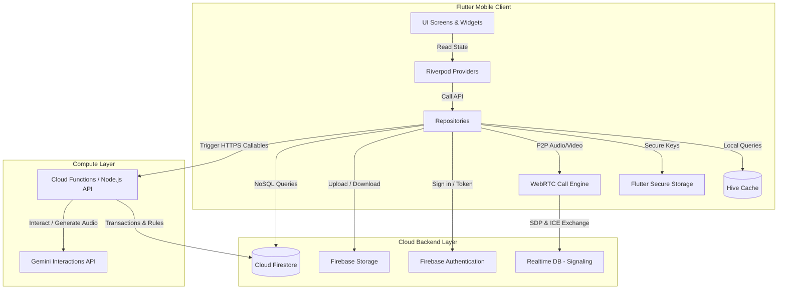

# Gotchaa

GOTCHAA — Connect globally, express visually, and communicate securely without language barriers.

Gotchaa is a production-grade, founder-led social super app built on Flutter, Node.js, and Firebase. Designed for seamless international interactions, it integrates end-to-end encrypted messaging, a short-form video creation platform with GPU shaders, geolocation community discovery, and multi-model AI workflows (Gemini & Groq) to deliver a modern, high-performance social ecosystem.

[](https://github.com/krishnasharma7011594-cmd/Gotchaa/actions/workflows/flutter-ci.yml)
[](https://github.com/krishnasharma7011594-cmd/Gotchaa/actions/workflows/web-backend-ci.yml)
[](https://github.com/krishnasharma7011594-cmd/Gotchaa/actions/workflows/firebase-deploy.yml)
[](LICENSE)

[Project Logo Placeholder]

[Website Placeholder] | [Demo Video Placeholder] | [Live Demo Placeholder]

---

## 📸 Screenshots

| Home Feed | Messaging | AI Assistant | Explore | Profile |
| --- | --- | --- | --- | --- |
|  |  |  |  |  |

---

## 🎥 Demo GIFs

| App Walkthrough | Encrypted Messaging | AI Sound Composer | Shaders & Creator Tools |
| --- | --- | --- | --- |
|  |  |  |  |

---

## 🌟 Features

### 🧠 Artificial Intelligence
* **Contextual Assistant:** Chat interface powered by `gemini-3-flash-preview` that dynamically refuses non-app topics and enforces platform context.
* **Intelligent Deep Linking:** Automatically extracts user intents to trigger routing pathways for third-party services (e.g. food delivery, transport, booking).
* **Local Translation Engine:** On-device low-latency translation and language identification utilizing Google ML Kit.
* **Multimodal Generation:** Serves as a gateway for Gemini-powered media generation including text-to-speech output.

### 💬 Messaging
* **VibeTalk Audio Rooms:** Real-time, voice-centric, and transcribed multi-user audio chat rooms.
* **WebRTC Calling:** High-fidelity real-time voice call connectivity managed through RTC session pools.
* **Media Messaging:** Safe and interactive exchange of dynamic stickers, gifs, audio recordings, and media attachments.

### 🎬 Creator Tools (Vybz)
* **Real-time Shaders:** Custom GPU fragment shaders (`beauty_smooth.frag`/`beauty_color.frag`) for hardware-accelerated camera filtering.
* **AI Sound Composer:** In-feed music generator using the Gemini Interactions API (`lyria-3-clip-preview`) saving files directly to Firebase Storage.
* **Shared Sound Library:** Shared public repository where users can catalog, sort, and reuse custom generated soundtracks.

### 🔒 Security & Privacy
* **Client-Side E2EE:** Direct chat sessions encrypted locally using Curve25519, AES-GCM, and SHA-256 keys.
* **Safety Verification:** Numeric fingerprint fingerprinting and QR safety numbers verified peer-to-peer.
* **Encrypted Storage:** Key material, recovery parameters, and flags secured locally using AES-based EncryptedSharedPreferences via Flutter Secure Storage.
* **Biometric Auth Integration:** Local authentication hooks protecting settings configurations and E2EE keys.

### 🌐 Discover & Social
* **Map-based Explore:** Custom location interfaces (`flutter_map`) fetching nearby posts and public circles within geo-coordinates.
* **Circles:** Discover localized community groups and discussion channels.
* **Dynamic Feed:** Custom feed mixer integrating story feeds, user text posts, and short-form video reels.

### 🛡️ Governance & Safety
* **Parental & Legal Gates:** Active verification controls validating age limit bounds (restricting matching strictly to 18+).
* **Automatic Moderation:** Automatic hash checks for CSAM patterns and automated escalation to Trust Teams.

---

## 📐 Architecture

Gotchaa is designed around a clean feature-driven architecture where features contain their respective presentation, domain, and data sources. State updates are pushed reactively from secure storage and database triggers.



[Architecture Diagram Placeholder]

---

## 🛠️ Technology Stack

| Frontend Layer | Technology | Version | Purpose |
| --- | --- | --- | --- |
| **Framework** | Flutter | `>=3.3.0` | Cross-platform UI layout engine |
| **State Management** | Riverpod | `^2.5.1` | Decoupled reactive state provider |
| **Local Storage** | Hive | `^2.2.3` | High-performance offline database caching |
| **Secure Key Store** | Flutter Secure Storage | `^10.3.1` | Encryption keys and session persistence |
| **Realtime P2P** | Flutter WebRTC | `^1.4.1` | P2P media channels for VibeTalk |
| **Audio Processing** | Just Audio | `^0.10.5` | Multi-source playback and session routing |

| Backend & Cloud | Technology | Version | Purpose |
| --- | --- | --- | --- |
| **Compute** | Node.js Express / Firebase Functions | Node `22` / SDK `^4.9.0` | Serverless backend API endpoint routes |
| **Primary Database** | Cloud Firestore | latest | Document schema storing users, posts, and configurations |
| **Signaling Store** | Firebase Realtime Database | latest | Lightweight sync layer for WebRTC signals |
| **Storage** | Cloud Storage for Firebase | latest | Storage bucket holding videos and audio files |
| **Auth Gateway** | Firebase Auth / Google Sign In | `^5.1.0` | Multi-provider sign-in and session verification |

| AI & Intelligence | Technology | Purpose |
| --- | --- | --- |
| **Music Generation** | Gemini Interactions API (`lyria-3-clip-preview`) | Text-to-audio soundtrack generation |
| **Core Assistant** | Google Generative AI (`gemini-3-flash-preview`) | Contextual app chatbot assistant |
| **Local Translation** | Google ML Kit Translation / Language ID | Offline translation and language checks |
| **Computer Vision** | Google ML Kit Face Detection / Selfie Segment | Vision filtering and camera shaders |

---

## 📁 Project Structure

```
Gotchaa/
├── android/                   # Native Android configuration
├── assets/                    # Static app resources
│   ├── animations/            # Lottie animation layers
│   ├── logo/                  # Icon and splash branding vectors
│   ├── shaders/               # GPU visual filter scripts ( beauty_smooth.frag )
│   └── stickers/              # Chat sticker templates
├── backend/                   # Legacy API server source files
├── functions/                 # Production Firebase Cloud Functions
│   ├── index.js               # Entrypoint for HTTPS callable operations
│   └── package.json           # Node configuration and dependencies
├── ios/                       # Native iOS build files
└── lib/                       # Flutter Core codebase
    ├── core/                  # Shared global utilities
    │   ├── config/            # Local constants and static settings
    │   ├── security/          # E2EE key algorithms and validations
    │   └── services/          # Real-time infrastructure providers
    └── features/              # Feature modules
        ├── ai/                # BRO Voice Assistant and chat components
        ├── chat/              # Chat pipelines and WebRTC handlers
        ├── explore/           # Location mapping and discovery filters
        ├── safety/            # Trust, age gating, and reporting
        └── vybz/              # Reels, camera shaders, and AI audio tools
```

---

## 📥 Installation

### 1. Pre-requisites
* Install [Flutter SDK](https://docs.flutter.dev/get-started/install) (Version `>=3.3.0`)
* Install [Node.js](https://nodejs.org/en) (Version `22.x`)
* Install [Firebase CLI](https://firebase.google.com/docs/cli):
  ```bash
  npm install -g firebase-tools
  ```

### 2. Get the Code
```bash
git clone https://github.com/krishnasharma7011594-cmd/Gotchaa.git
cd Gotchaa
```

### 3. Native Configurations
Register your application in your Firebase Console and download:
* For Android: Place `google-services.json` in `android/app/`
* For iOS: Place `GoogleService-Info.plist` in `ios/Runner/`

---

## ⚙️ Configuration

### Environment Variables
Configure your backend environment values. Create a `.env` file under `functions/`:

| Variable | Description |
| --- | --- |
| `GEMINI_API_KEY` | Developer API key for accessing Google AI Studio models |
| `GROQ_API_KEY` | Developer API key for Groq engine processing |
| `SPOTIFY_CLIENT_ID` | Spotify Client Credentials ID for search capabilities |
| `SPOTIFY_CLIENT_SECRET` | Spotify client credentials secret |
| `LYRIA_DEFAULT_MODEL` | Targeting identifier for Gemini audio (lyria-3-clip-preview) |

### App Compile Time Variables
Gotchaa injects security credentials at build time to prevent hardcoding keys.

Compile script:
```bash
--dart-define=GEMINI_API_KEY=YOUR_API_KEY_HERE
```

---

## 🏃 Running Locally

<details>
<summary><b>1. Firebase Emulators</b></summary>

For local offline debugging, run the suite of Firebase Emulators:
```bash
firebase emulators:start --only firestore,database,storage,functions
```
</details>

<details>
<summary><b>2. Backend Functions</b></summary>

Verify dependencies and serve cloud configurations locally:
```bash
cd functions
npm install
npm run serve
```
</details>

<details>
<summary><b>3. Flutter Client (Development)</b></summary>

Run the app on your debug device:
```bash
flutter pub get
flutter run --dart-define=GEMINI_API_KEY=YOUR_API_KEY_HERE
```
</details>

<details>
<summary><b>4. Production Build (APK Release)</b></summary>

Generate the release binaries split by CPU architecture:
```bash
flutter build apk --release --split-per-abi --dart-define=GEMINI_API_KEY=YOUR_API_KEY_HERE
```
</details>

---

## 🔄 CI/CD

The workflows in `.github/workflows/` automate checks:
* **Flutter CI (`flutter-ci.yml`):** Runs static analysis (`flutter analyze`) and tests for any push or pull request hitting targeted development branches.
* **Web & Backend CI (`web-backend-ci.yml`):** Automatically boots environment containers, tests syntax on node entry points, and runs Mocha test assertions.
* **Firebase Deploy (`firebase-deploy.yml`):** Automates serverless deployment of modified Functions scripts, security index updates, and schema rules to your Firebase console.

---

## 🔒 Security & Privacy

Gotchaa is built with a defense-in-depth architecture to ensure user data remains secure and private.
* **Client-Side E2EE:** Direct chat messages are encrypted on-device before transmission using Curve25519 key agreements and AES-GCM encryption, guaranteeing that message content remains unreadable by intermediate infrastructure.
* **Device-Level Protection:** Encryption keys, local session parameters, and biometric preferences are secured inside hardware-backed storage (iOS Keychain and Android Keystore).
* **Edge & Anti-Abuse Hardening:** All client-facing endpoints are protected via Firebase App Check to prevent unauthorized automated abuse, combined with serverless scaling controls and rate limits.
* **Granular Access Control:** Core application data access is enforced at the database and storage level via strict Firestore and Cloud Storage security rules, combined with role-based checks.

For a detailed breakdown of our security posture, encryption models, and access control flows, see our [SECURITY.md](SECURITY.md) file.

---

## ⚡ Performance

The following performance benchmarks are placeholder references to be verified in staging:

| Metric | Target Value |
| --- | --- |
| **Startup Time (Cold)** | [Startup Time Placeholder] |
| **APK Size (Compressed)** | [APK Size Placeholder] |
| **Memory Usage (Idle)** | [Memory Usage Placeholder] |
| **Target Frame Rate (UI)** | [Frame Rate Placeholder] |
| **Average API Response Time** | [API Response Time Placeholder] |

---

## 🗺️ Roadmap

- [x] Integrate E2EE protocol utilizing Curve25519 key agreements
- [x] Develop on-device shaders (`beauty_smooth.frag`) for camera streams
- [x] Migrate sound generators to serverless Firebase Cloud Functions
- [x] Embed multi-intent voice queries in BRO assistant screen
- [ ] Implement group call WebRTC connectivity rooms
- [ ] Connect localized geo-spatial clusters for feed queries
- [ ] [Staging Roadmap Item Placeholder]

---

## 🐞 Known Issues

* [Known Issue Placeholder 1]
* [Known Issue Placeholder 2]

---

## 🔮 Future Plans

* [Future Plan Placeholder 1]
* [Future Plan Placeholder 2]

---

## 🤝 Contributing

Contributions to Gotchaa are currently restricted. The repository is not open to external pull requests. For questions regarding source verification or collaborative opportunities, please contact the founder.

---

## 📄 License

Gotchaa is distributed under the MIT License. See [LICENSE](LICENSE) for more details.

---

## 📬 Contact

* **Founder:** Krishna Sharma
* **GitHub:** [@krishnasharma7011594](https://github.com/krishnasharma7011594-cmd)
* **LinkedIn:** [LinkedIn Placeholder]
* **Website:** [Website Placeholder]
* **Email:** [Email Placeholder]
* **X (Twitter):** [X Placeholder]

---

## 💡 Support

* **Star:** Star this repository to show your support!
* **Issues:** Report bugs or submit feature proposals.
* **Sponsorship:** [Sponsorship Placeholder]

---

<p align="center">
  Made with ❤️ by Krishna Sharma
</p>
