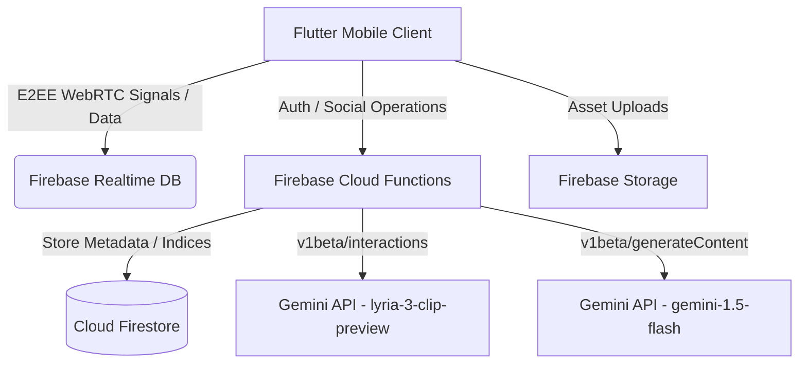
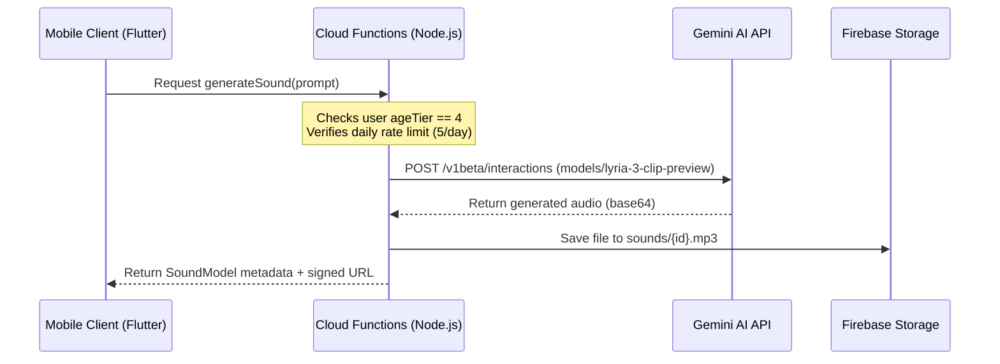

# Gotchaa

> Connect globally, express visually, and communicate securely without language barriers.

Gotchaa is a founder-led, high-performance social super app built on Flutter, Node.js Express, and Firebase. Designed for active multi-country interactions, it integrates secure, end-to-end encrypted messaging, short-form creative video streams, local geographical discovery, and multi-model AI modules to deliver a seamless, state-of-the-art social experience.



---

## 🌟 Core Features

### 1. Messaging & Encrypted Channels
* **End-to-End Encryption (E2EE):** Direct messaging streams are secured using out-of-band key exchanges (Curve25519, AES-GCM, SHA-256) persisting safety key fingerprints via native secure storage.
* **VibeTalk Rooms:** Audio-centric real-time chat rooms powered by WebRTC.
* **Interactive Media:** Secure exchange of stickers, gifs, images, and audio messages.

### 2. Vybz (Short-Form Creator Feed)
* **Real-time Video Processing:** Hardware-accelerated camera capturing with custom fragment shaders (`beauty_smooth.frag`/`beauty_color.frag`) for real-time visual enhancements.
* **AI Music Composer:** Seamless sound generation utilizing the **Gemini Interactions API** (`lyria-3-clip-preview`) directly within the create feed. Generated tracks are saved to Firebase Storage and cataloged in a shared, public library.

### 3. Gotchaa AI Assistant (BRO Voice & Chat)
* **Context-Bound Agent:** Integrated chatbot running `gemini-3-flash-preview` focused entirely on answering Gotchaa questions.
* **Smart Mini-App Launcher:** Intelligently intercepts voice or text requests to automatically trigger deep links to external services (such as cab bookings via Rapido/Uber, food ordering via Fassos/Swiggy, grocery runs via Zepto/Blinkit, or health consults via Practo).

### 4. Circles & Explore
* **Geographical Discovery:** Map-based local explorer view (`flutter_map`) to discover localized user content, active rooms, and circles.
* **Real-time Proximity:** Queries Firestore using localized coordinate bounds to show nearby communities.

### 5. Karma & Governance
* **Gamified Contributions:** Keeps track of positive interaction patterns, rewarding constructive users with positive Karma points.
* **Trust & Safety Gates:** Complete compliance pipelines, including age verification (restricting matching features strictly to 18+ verified adult users), parental consent checking, CSAM automated hash flags, and trust team escalation channels.

---

## ⚙️ Technical Architecture

Gotchaa uses a decoupled, hybrid serverless structure:

* **Frontend:** A structured Flutter application organized by feature modules (`lib/features/*`). App state is managed strictly using **Riverpod** with code generation (`riverpod_generator`). Local offline synchronization uses **Hive** caching.
* **Backend Functions:** Firebase Cloud Functions (`functions/index.js`) serve as the main, secure gateway, handling high-privilege operations such as AI music generation (interacting with the Gemini API server-to-server), user matching limits, and administrative safety audits.
* **Local Translation Stack:** Uses **Google ML Kit** running entirely on-device to translate texts and identify language codes without triggering high-latency network queries.



---

## 🛠️ Tech Stack

| Layer | Technology | Version | Detail |
| --- | --- | --- | --- |
| **Frontend** | Flutter / Dart | `SDK ^3.3.0` | Riverpod, GoRouter, Hive, JustAudio, WebRTC |
| **Backend** | Express / Node.js | `22` | API routing and rate-limiting middleware |
| **Functions** | Firebase Functions SDK | `^4.9.0` | Serverless API routes (generateSound, findVibeMatch) |
| **Database** | Cloud Firestore / RTDB | latest | Document-based social model + live message queues |
| **AI** | Gemini API / Google ML Kit | `^0.13.x` | On-device translation + multimodal audio creation |
| **CI/CD** | GitHub Actions | active | Testing, Lint verification, and deployment runs |

---

## 🚀 Getting Started

### Prerequisites
* Flutter SDK (Version `>=3.3.0`)
* Node.js (Version `22.x`)
* Firebase CLI installed (`npm install -g firebase-tools`)

### 1. Repository Setup
```bash
git clone https://github.com/krishnasharma7011594-cmd/Gotchaa.git
cd Gotchaa
```

### 2. Configure Backend Environment
Create a `.env` file in the `functions/` directory:
```bash
# functions/.env
GEMINI_API_KEY=your_gemini_api_key_here
```

### 3. Run Firebase Cloud Functions Locally
To run and test the backend callable APIs locally using the Firebase emulator:
```bash
cd functions
npm install
npm run serve
```

### 4. Run the Mobile App
Inject your Gemini API Key at build time to run the application:
```bash
flutter pub get
flutter run --dart-define=GEMINI_API_KEY=your_gemini_api_key_here
```

---

## 🔄 CI/CD Workflows

Gotchaa uses GitHub Actions for continuous integration:
* **Flutter Verification (flutter-ci.yml):** Automatically runs static analyzer checks (`flutter analyze`) and tests on pushes to the `main` or `master` branches.
* **Web Backend CI (web-backend-ci.yml):** Installs node dependencies, validates syntax, and triggers backend unit tests.
* **Firebase Deploy (firebase-deploy.yml):** Manages live deployment of updated Cloud Functions, firestore security rules, and index sets.

---

## 🤝 Contributing

Gotchaa is currently closed to public external contributions. For collaboration requests or security disclosures, please contact the founder directly.

---

## 📄 License
Licensed under the MIT License.

---

## 📬 Contact
**Founder:** Krishna Sharma  
**Github:** [@krishnasharma7011594](https://github.com/krishnasharma7011594-cmd)
