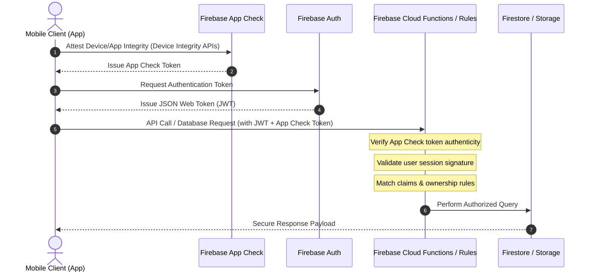

# Gotchaa Security & Privacy Architecture

## Introduction
Gotchaa is designed to keep user communication and personal data secure. This document outlines the security controls, authentication mechanisms, and encryption protocols implemented across the Gotchaa mobile client and Firebase cloud backend.

Our security posture focuses on protecting:
1. **User Communications:** Ensuring message content is private via End-to-End Encryption (E2EE).
2. **Media Attachments:** Securing images, video, and audio uploads in storage.
3. **Account Integrity:** Protecting user profiles, verification tokens, and administrative roles.

---

## Authentication & Access Control Flow
All client interactions with the Firebase backend layer follow a strict verification pipeline. No client request has direct database write permissions without validating identity, device authenticity, and role-based checks.



---

## End-to-End Encryption (E2EE) Architecture
Gotchaa uses client-side encryption for direct text and media messages. The server acts strictly as an untrusted transport relay and cannot decrypt message content.

```mermaid
graph TD
    subgraph Sender Device [Sender Device]
        SKG[Ephemeral Key Generation] -->|X25519 Key Exchange| SE[Shared Secret Derivation]
        Plain[Plaintext Message] -->|AES-GCM-256 Encryption| Cipher[Encrypted Ciphertext]
        SE -->|Symmetric Key| Cipher
    end

    subgraph Transport [Cloud Backend]
        Relay[Firebase Infrastructure]
        Note over Relay: Relay stores/forwards ciphertext only.<br>Has no access to key material.
    end

    subgraph Recipient Device [Recipient Device]
        RK[Recipient Private Key] -->|X25519 Key Exchange| RE[Shared Secret Derivation]
        RCipher[Ciphertext] -->|AES-GCM-256 Decryption| RPlain[Decrypted Plaintext]
        RE -->|Symmetric Key| RCipher
    end

    Cipher -->|Upload Ciphertext| Relay
    Relay -->|Deliver Payload| RCipher
```

> [!IMPORTANT]
> **Encryption Guarantee:** Because session key derivation (Diffie-Hellman via X25519) and message encryption/decryption happen exclusively on-device, the backend infrastructure only ever handles encrypted ciphertext. The platform operators cannot read message contents or access private keys.

---

## Layers of Abuse & Platform Protection

### 1. Device Attestation & App Check
Gotchaa integrates App Check (utilizing Device Check on iOS and Play Integrity on Android) to block API requests coming from unauthorized clients, simulators, scripts, or botnets. 

### 2. Rule-Based Resource Access
Firestore and Cloud Storage rules enforce strict data boundaries:
* **Message Privacy:** Read/write access to individual chat streams is restricted strictly to verified participants of that chat.
* **Content Ownership:** Users can only modify or delete their own posts, profile fields, and uploaded media.
* **Field Locking:** Sensitive system metadata (such as roles, account limits, and verification levels) is locked against client-side writes and can only be modified by administrative backends.

### 3. Serverless Scaling & Rate Limiting
To mitigate Denial of Service (DoS) and API abuse:
* **Callable Functions:** Hard concurrency limits (`maxInstances`) restrict the resource foot-print of backend endpoints.
* **Multi-Factor Auth Gating:** Failed attempts are tracked via serverless tracking collections, locking out authentication pathways after consecutive failures.
* **Payload Constraints:** Strict limits are enforced on incoming API body sizes to prevent memory exhaustion attacks.

---

## Responsible Disclosure
If you discover a security vulnerability in this project, please report it directly to the repository administrator / founder via email or private channels. Please do not open public issues regarding vulnerability details.

---

## Security Verification History
* **Last Review Date:** July 11, 2026
* **Scope & Hardening:** Completed privilege-escalation mitigations, custom claims verification, Storage rule bypass fixes, and backend resource limits.
